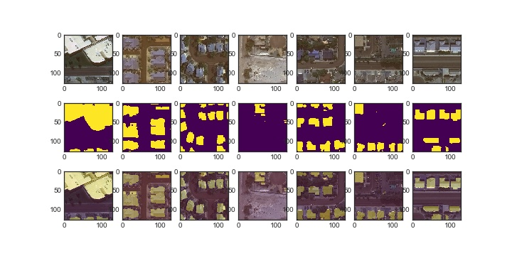

# UNET-Image-Segmentation-Satellite-Pictures
Project to predict housing rooftops on satellite pictures

## Description:

Unet to predict roof tops on satellite pictures. Training the model was done with 10000 satellite pictures from the Crowed AI Mapping Challenge.
Mask created with MS Coco annotations. Project includes automatic Mask creation for Train and validation set, Unet model with optimizer, data processing including a Generator function and a function for creating plots. Pretrained weights are also included from which the following plots were created.

(see also Example_Plots)

## Prerequisites:

Done with anaconda environment, see Environment for details.

## Data:

Model was trained and evaluated with data from the crowed ai mapping challenge. Moderate data augmentation was used: horizontal and vertical flips.
Data Augmentation was added the in the generator and randomly executed, see dataprocessing.

## Model:

Unet model (Decoder - Encoder Network) with Adamax optimizer, loss is calculated by binary crossentropy.

## Get Started:

Good start includes:
* Create Conda environment
* Run environment file to install prerequisites
* Run: "main.py -M Init_Dir" to initialize the directories
* copy your data into the directories, e. g. your trainings data in "/Data/raw/Image/Train/Images/" (see get_data_dict in Utils.py)
* copy your annotations as .json into directories, e. g. your trainings data in "/Data/raw/Annotations/Val/" and change file name to "annotation.json" (see get_data_dict in Utils.py)
* create masks by running: "main.py -M Mask" to create by default 1000 masks for both vaidation and training Segmentation
* Adjust main.py and run/train the model
